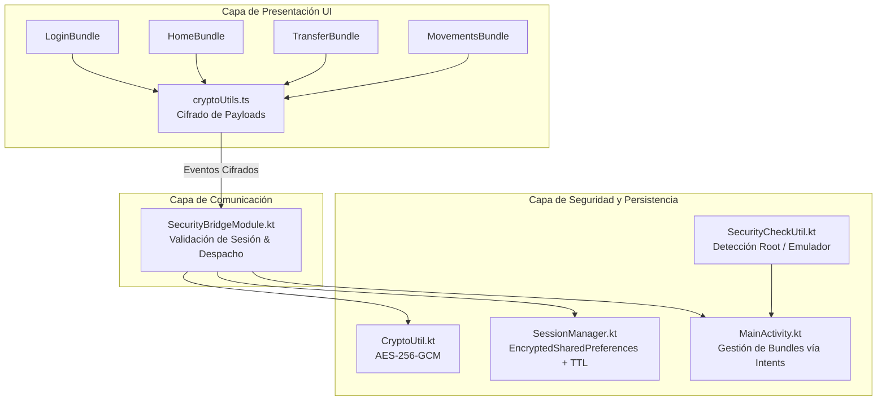
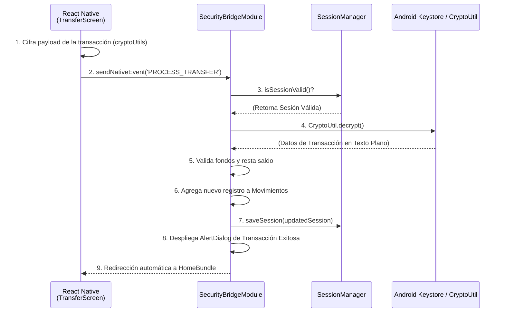

# 🏛️ Arquitectura del Sistema

La solución adopta un patrón **Clean Architecture / Brownfield Bridge**, integrando de manera segura una capa de interfaz gráfica híbrida con módulos nativos robustos y almacenamiento encriptado.

## Diagrama General de Arquitectura

## Capas Arquitectónicas

### A. Capa de Presentación (React Native / UI)
- Componentes independientes y desacoplados (`LoginBundle`, `HomeBundle`, `TransferBundle`, `MovementsBundle`).
- Cada bundle de React Native funciona como una vista aislada, permitiendo cargas eficientes.
- Comunica las intenciones del usuario al entorno nativo mediante el puente asíncrono (`NativeModules.SecurityBridgeModule`).
- Cuenta con hooks de validación y cifrado simétrico en cliente (`cryptoUtils`).

### B. Capa de Puente de Seguridad (`SecurityBridgeModule.kt`)
- Intermediario estricto entre JavaScript y Android.
- Recibe eventos cifrados (`PROCESS_TRANSFER`, `LOGIN_SUCCESS`, etc).
- Valida el estado de la sesión y desencripta los *payloads* mediante `CryptoUtil`.
- Ejecuta operaciones críticas de negocio (actualización de saldos, registro de movimientos) y emite alertas nativas interactivas (`AlertDialog`).

### C. Capa Nativa de Seguridad y Persistencia (`Android OS`)
- **`SplashActivity`**: Punto de entrada inicial. Ejecuta pruebas de integridad del sistema a través de `SecurityCheckUtil` para detectar entornos con *root* o emulados antes de autorizar la carga del runtime de React Native.
- **`SessionManager`**: Administra el almacenamiento seguro utilizando `EncryptedSharedPreferences`, el cual está respaldado físicamente por el **Android Keystore**.
- **TTL y Expiración**: Evalúa la validez temporal de la sesión (milisegundos) en cada ciclo de vida nativo para evitar retención insegura de datos.

---

## Flujo de Transacción Segura

El siguiente diagrama detalla cómo se maneja una transacción (por ejemplo, una transferencia) de forma end-to-end garantizando que la lógica de negocio sensible permanezca en el lado nativo:

---

## Resumen de Bundles Registrados

- **`LoginBundle`**: Solicita credenciales, genera el payload cifrado y lo envía a través de `SecurityBridge.sendNativeEvent('LOGIN_SUCCESS', encryptedData)`.
- **`HomeBundle`**: Descifra y muestra de forma reactiva los datos del usuario, el saldo disponible y accesos directos de la app.
- **`TransferBundle`**: Presenta el formulario, recolecta destinatario y monto, cifra la transacción y la remite al nativo.
- **`MovementsBundle`**: Lee y procesa el historial de transferencias que se mantiene seguro y se actualiza a través del puente nativo.
